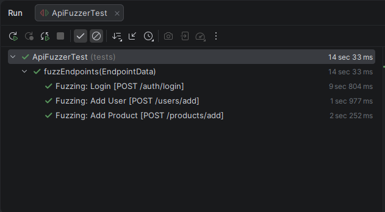
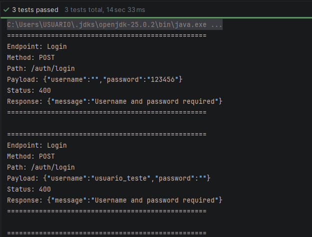
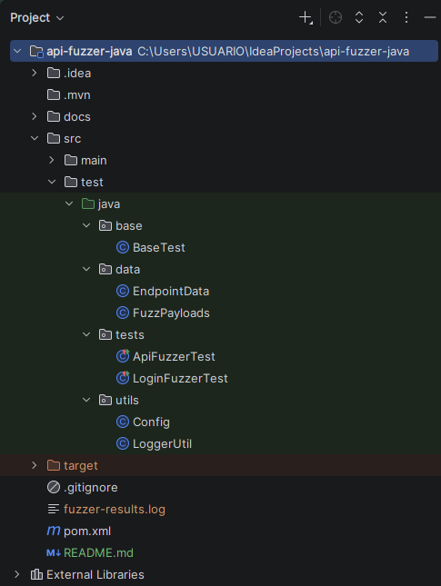

# API Fuzzer | Java

Ferramenta de API Fuzzing desenvolvida em Java com foco em validar a robustez de endpoints através de testes com entradas inválidas, inesperadas e maliciosas.

O objetivo é garantir que a API **não quebre (HTTP 500)** e trate corretamente erros.

<p align="left">
  
  
  
  
  
</p>

---

## Objetivo:

Validar se a API:

 ✔ Trata entradas inválidas corretamente
 
 ✔ Responde com status apropriados
 
 ✔ Mantém estabilidade
 
 ❌ Não retorna erro crítico (500)

---

## Estratégia de Fuzz Testing:

O projeto executa testes com diferentes tipos de payload:

* Campos vazios
* Campos ausentes
* Strings extremamente grandes
* SQL Injection
* XSS
* Valores `null`
* Tipos incorretos
* Unicode

---

## Evidências de execução:

### Execução dos testes:



---

### Logs gerados:



---

### Estrutura do projeto:



---

## Como executar o projeto:

```bash
mvn test
```

Ou execute diretamente pelo IntelliJ clicando no ▶️ na classe `ApiFuzzerTest`.

---

## Regra principal do projeto:

```
❌ A API NÃO pode retornar HTTP 500
```

Se isso acontecer:

```
🚨 BUG CRÍTICO ENCONTRADO
```

---

## Logs:

Os resultados são salvos automaticamente em:

```
fuzzer-results.log
```

Incluindo:

* payload enviado
* status retornado
* response da API

---

## Diferenciais:

✔ Testes negativos avançados

✔ Fuzz testing automatizado

✔ Múltiplos endpoints

✔ Estrutura escalável

✔ Logs de evidência

✔ Testes parametrizados

---

## Próximas melhorias:

* Relatórios HTML (Allure)
* Execução via CLI
* Integração com CI/CD
* Fuzzing dinâmico via JSON

---

🌸 Desenvolvido por Giovanna Fernandes

Estudante de Sistemas de Informação

Focada em Quality Assurance (QA)
